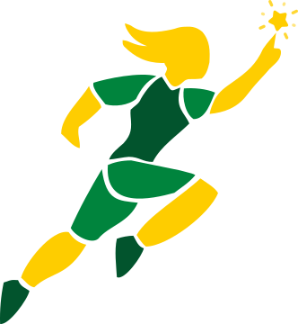
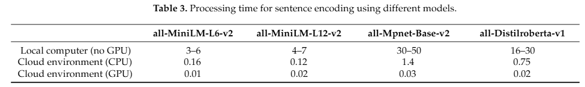
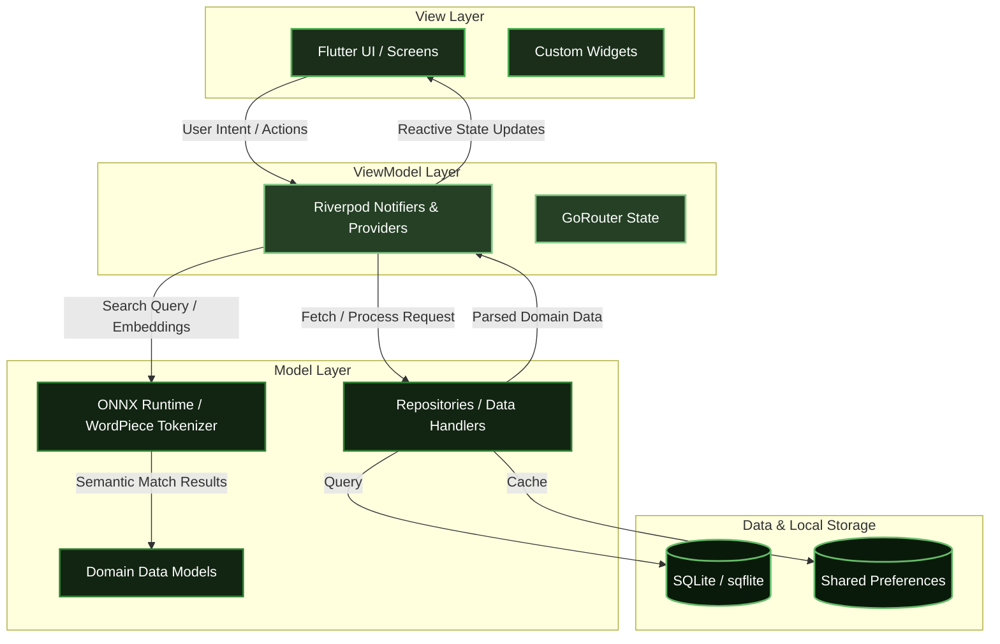
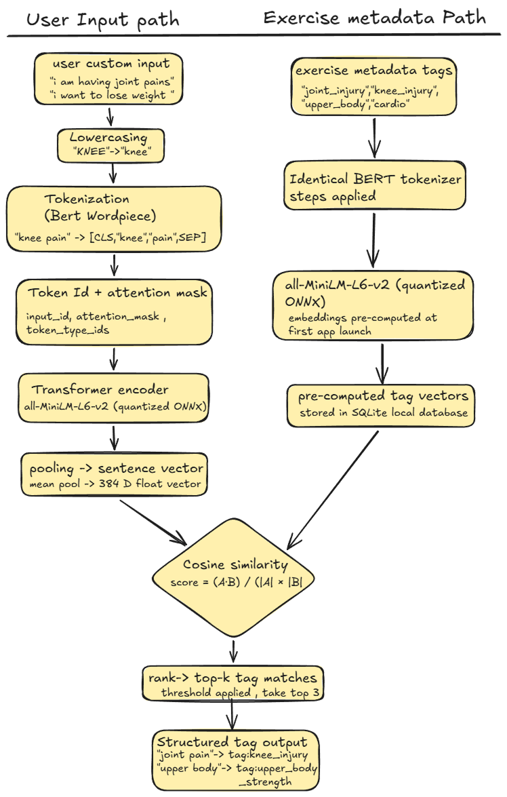
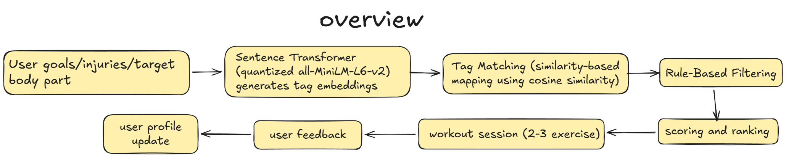
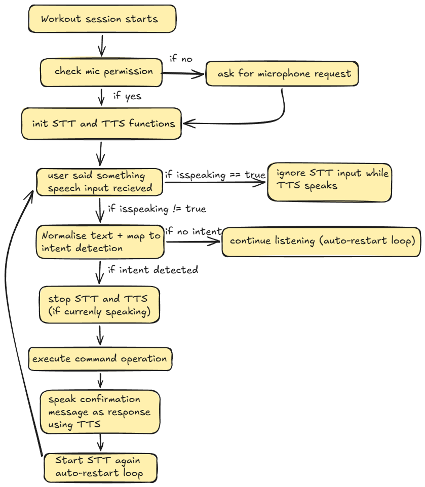
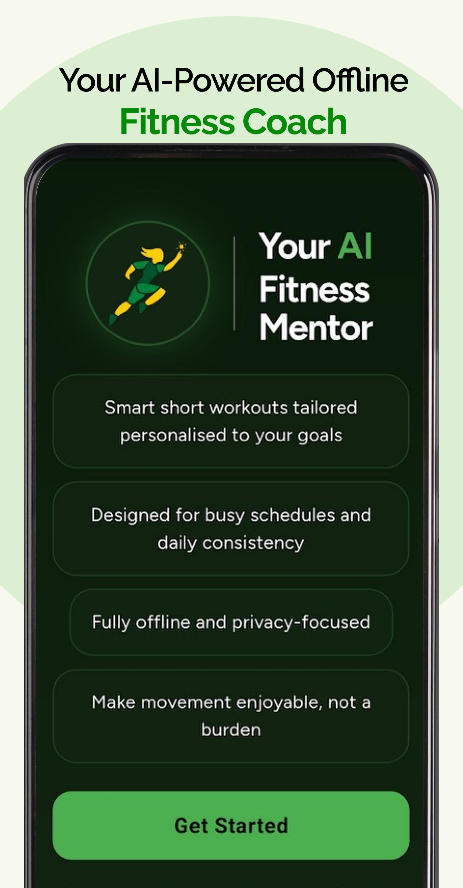
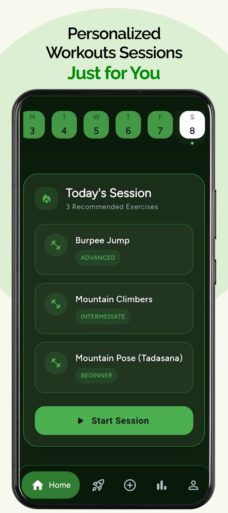
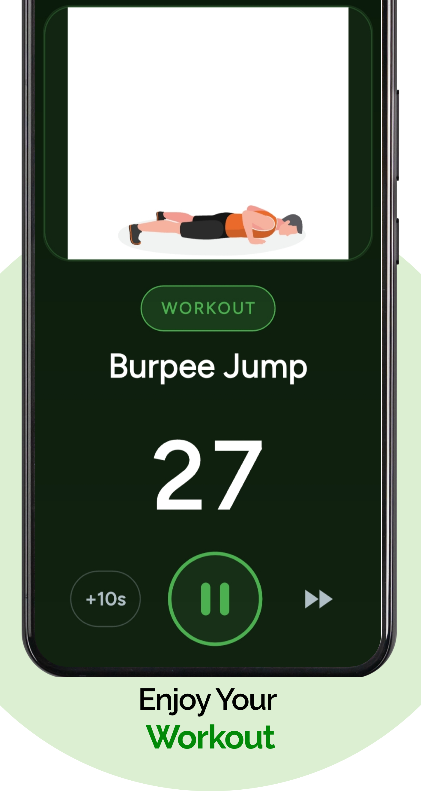

<!-- Don't delete it -->
<div name="readme-top"></div>

<!-- Organization Logo -->
<div align="center" style="display: flex; align-items: center; justify-content: center; gap: 16px;">
  
  
</div>

&nbsp;

<!-- Organization Name -->
<div align="center">
  <a href="https://aossie.org/"></a>
</div>

<!-- Organization/Project Social Handles -->
<p align="center">
<!-- Telegram -->
<a href="https://t.me/StabilityNexus">
</a>
&nbsp;&nbsp;
<!-- X (formerly Twitter) -->
<a href="https://x.com/aossie_org">
</a>
&nbsp;&nbsp;
<!-- Discord -->
<a href="https://discord.com/channels/1022871757289422898/1500966300782956634">
</a>
&nbsp;&nbsp;
<!-- Medium -->
<a href="https://news.stability.nexus/">
  </a>
&nbsp;&nbsp;
<!-- LinkedIn -->
<a href="https://www.linkedin.com/company/aossie/">
  </a>
&nbsp;&nbsp;
<!-- Youtube -->
<a href="https://www.youtube.com/@AOSSIE-Org">
  </a>
</p>

---

<div align="center">
<h1>MoveYourBody</h1>
</div>

**MoveYourBody** is a privacy-first, on-device fitness application designed to help you stay consistent with your goals. It provides personalized, short micro-workout sessions (5–7 minutes) that adapt based on your feedback and health conditions. By running completely offline, MoveYourBody combines rule-based filtering and lightweight semantic matching to ensure your workout data stays entirely private while delivering safe, relevant, and engaging exercises.

---

## 🚀 Features

- **Micro-Workout Sessions**: Stay consistent with short, 5-7 minute micro-sessions. You'll receive 2-3 sessions per day, with each session consisting of 3 exercises, complete with built-in notifications.
- **Personalized Exercise Selection**: Uses an on-device embedding pipeline to match exercises to your goals. It avoids recently performed exercises to prevent boredom, filters out unsafe movements based on your injuries, and adapts difficulty through post-workout feedback.
- **High-Quality Animations & Guidance**: Understand every movement with crystal-clear animations and instructions that teach you the correct posture.
- **Voice-Controlled Interface**: Enjoy a hands-free workout experience with voice commands to start, pause, skip, or repeat instructions during a session.
- **Body Focus Workouts**: Want to target a specific muscle group? Choose from pre-defined sessions tailored for quick, muscle-specific training.
- **Custom Workout Creation**: Take full control. Explore a database of over 100+ exercises to learn, mix, and build your own custom, flexible workout routines.
- **Progress & Motivation**: Visualize your consistency and fitness journey with an interactive stats screen, calendar views, and performance charts.
- **Privacy-First & 100% Offline**: Everything runs on-device. Your health data, feedback, and embedded semantic searches never leave your phone.

---

## 💻 Tech Stack

### Mobile Frontend
- **Framework**: Flutter
- **State Management**: Riverpod
- **Routing**: GoRouter
- **UI/Animations**: Lottie, Video Player, Google Fonts, FL Chart

### Local Backend & Data
- **Database**: SQLite (`sqflite`)
- **Caching**: Shared Preferences, Flutter Cache Manager
- **Search Utilities**: Fuzzy string matching

### On-Device AI
- **Inference**: Flutter ONNX Runtime
- **Tokenization**: Dart WordPiece
- **Models**: [all-MiniLM-L6-v2](https://huggingface.co/sentence-transformers/all-MiniLM-L6-v2) (Quantized ONNX model running directly on-device via `assets/models/model_quantized.onnx`)

---

## ✅ Project Checklist

- [x] **The mobile app**:
   - [ ] has an _About_ page containing the Stability Nexus's logo and pointing to the social media accounts of the Stability Nexus.
   - [ ] is available for download as a release in this repo.
   - [ ] is available in the relevant app stores.
- [x] **The AI/ML components**:
   - [x] LLM/model selection and configuration are documented.
      - **Model Selection**: [all-MiniLM-L6-v2](https://huggingface.co/sentence-transformers/all-MiniLM-L6-v2) was chosen because it is designed specifically for sentence similarity tasks. It provides low latency and fast inference which is highly suitable for on-device cases (see [Research Paper](https://www.researchgate.net/publication/377627749_Performance_of_4_Pre-Trained_Sentence_Transformer_Models_in_the_Semantic_Query_of_a_Systematic_Review_Dataset_on_Peri-Implantitis)).
      - **Configuration**: ONNX models are quantized and bundled locally in assets, with tokenization logic strictly handled on-device.
      - 
   - [ ] Prompts and system instructions are version-controlled.
   - [ ] Content safety and moderation mechanisms are implemented.
   - [ ] API keys and rate limits are properly managed.

---

## 🔗 Repository Links

1. [Main Repository](https://github.com/AOSSIE-Org/MoveYourBody)

---

## 🏗️ Architecture

### 1. High-Level MVVM Architecture

The application follows a robust **Model-View-ViewModel (MVVM) with Repository Pattern** architecture, utilizing Riverpod as the reactive state-management (ViewModel) layer to keep the UI strictly separated from the business and data logic.



- **View Layer**: Contains the modular Flutter screens and reusable UI components. Responsible only for rendering state and capturing user input.
- **ViewModel Layer (Riverpod)**: Acts as the bridge between the View and Model. It holds the business logic, manages the state of the UI, and interacts with repositories.
- **Model Layer**: Contains the core domain structures (Data Models) and the **Repositories**, which abstract the logic required to access data sources. Includes ONNX inference logic.
- **Data Layer**: Manages local persistence using SQLite for offline-first capabilities and Shared Preferences for caching.

### 2. Custom Input to Tags Pipeline


*(Illustrates how user input is processed and mapped to semantic tags)*

### 3. Recommendation Algorithm Overview


*(Overview of rule-based filtering, injury exclusion, and semantic matching)*

### 4. Voice Control Pipeline


*(Flowchart detailing how voice commands are captured, processed, and executed)*

---

## 🔄 User Flow

```text
User opens the app
        ↓
User completes onboarding (details, goals, injuries)
        ↓
Algorithm & AI create a personalized micro-session
        ↓
User executes and completes the workout session
        ↓
User submits post-workout ratings and feedback
        ↓
System adapts and tailors the next session based on feedback
        ↓
User receives notification when the next customized session is ready
```

---

## 🍀 Getting Started

### Prerequisites

- Flutter SDK
- Dart SDK
- Android Studio / Xcode (for emulation and building)

### Installation

#### 1. Clone the Repository

```bash
git clone https://github.com/AOSSIE-Org/MoveYourBody.git
cd MoveYourBody
```

#### 2. Install Dependencies

```bash
flutter pub get
```

#### 3. Generate Riverpod Code

```bash
dart run build_runner build --delete-conflicting-outputs
```

#### 4. Generate Exercise Database

Run the provided Python script to set up the local exercise database.

```bash
python scripts/generate_exercise_db.py
```

#### 5. Run the Application

Ensure you have a simulator running or a device connected.

```bash
flutter run
```

---

## 📱 App Screenshots

| | | |
|:---:|:---:|:---:|
|  |  |  |

---

## 🙌 Contributing

⭐ Don't forget to star this repository if you find it useful! ⭐

Thank you for considering contributing to this project! Contributions are highly appreciated and welcomed, read the [CONTRIBUTING.md](./CONTRIBUTING.md) for setting the project.

*Note: Before opening a UI Pull Request, please ensure you read our [brand.md](./brand/brand.md) file for styling guidelines.*

---

## 📍 License

This project is licensed under the GNU General Public License v3.0.
See the [LICENSE](LICENSE) file for details.

---

## 💪 Thanks To All Contributors

Thanks a lot for spending your time helping MoveYourBody grow. Keep rocking 🥂

[](https://github.com/AOSSIE-Org/MoveYourBody/graphs/contributors)

© 2026 AOSSIE
